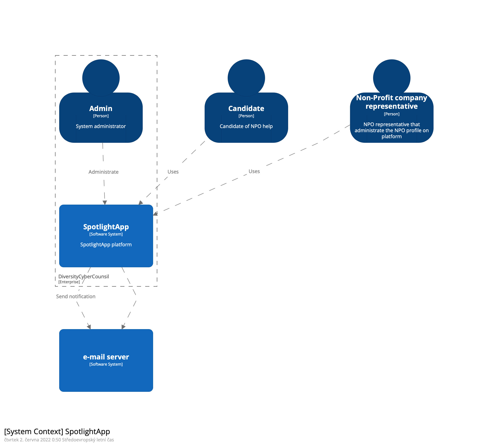
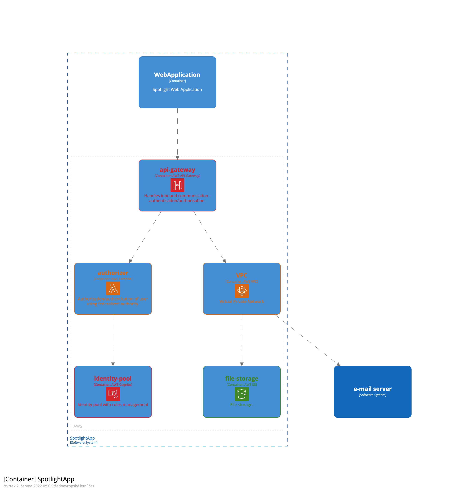
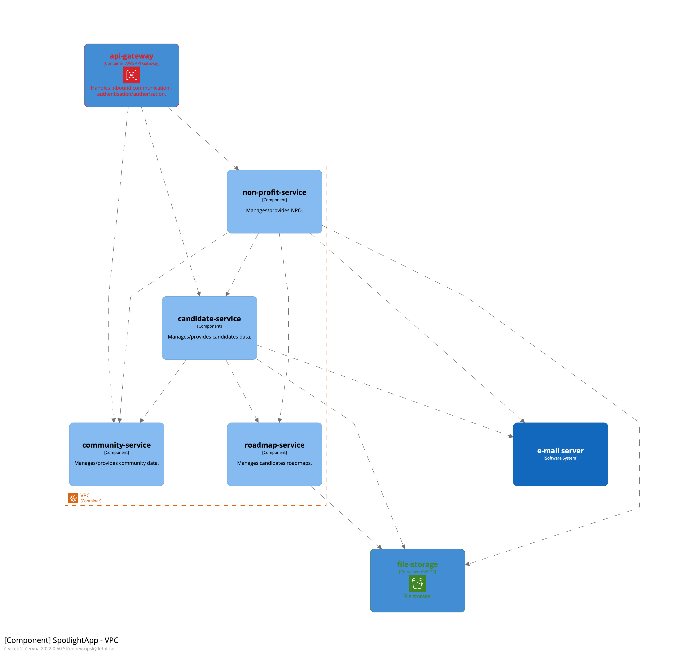

# Development view

The development view illustrates a system from a programmer's perspective and is concerned with software management. This view is also known as the implementation view.
In this section, the development view is split in 3 separate layers (C4 model):
- System Context
- Container
- Component

---

## System Context

High-level overview of SpotlightApp interactions with external world.

## Container

## Component

