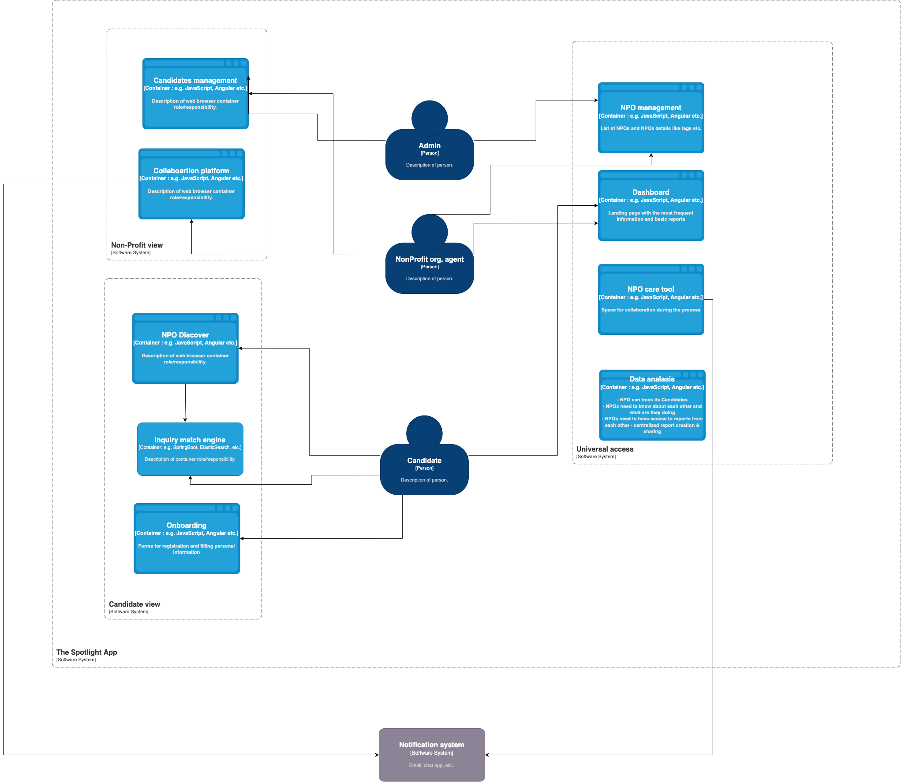

# Logical view 

## Glossary
* **NPO** - Non profit organisation
* **Candidate** - Person the NPO helps to find and keep a job
* **Provider** - Person or organisation who helps the NPO to serve its clients. The providers may include NPOs employee or third party providers like teachers, mentors, babysitters, funders, etc.

## About the problem [taken from O'Reilly Architecture Katas 2022 assignment]
Idea how it works
NPO helps candidates to find a job. To help them finding a job and be able to keep it, different NPOs provides support in different areas:

* Resume Writing services
* Interview preparation
* Free business attire (clothes lending)
* Apprenticeship programs and registration
* Training program registrations
* Free grocery and meal services
* Day care and babysitting services
* etc..

How it works?

1. Candidate registers and fills in his job preferences, skills and needs for above stated services
2. System automatically and manually allow for preparation of path fo given candidate based on given needs.
3. Candidate can see the plan and register on or reserve terms for particular steps at particular NGOs. Each NGO is notified about this new candidate and the services it provides to him. Each NGO can see Canidates profile and history
4. Candidate is notified about upcomming training, appoitments etc..
…

## Domains identification

### NPOs collaboration
`Problem statement #1: The Spotlight App Project is a sustained effort to amass a coalition of nonprofits in order to address specific needs within the communities we serve by leveraging a centralized platform as the base of operations to collaborate and make a collective impact.Problem Statement #1: The decentralization and lack of support between nonprofits create gaps of service and overall impact.`

 * NPOs need to know about each other and what are they doing
 * NPOs need to ask for resources they lack - funding, human resources, other resources..
 * NPOs need to be offered these resources. Providers can offer its services or can react or particular NPO demand
 * NPOs need collaboration platform for cooperation on particular projects  - one NGO offers resume and interview service, other joins and provides trainings, another joins and provides day care and baby sitting..
 * NPOs need to have access to reports from each other - centralized report creation & sharing

### NPOs visibility
`Problem statement #2: The lack of visibility of nonprofit groups and offerings creates a barrier of access to the people we aim to serve.`

 * Candidates can list NPOs and their offerings
 * Candidates can submit inquiry. NPOs can list, react on and be notified about these inquiries.
   * System can match automatically inquiry with offering
 * NPO can create asessment of each candidate's needs. Based on the needs, System contacts other NPOs to provide services based on the needs for given candidate
   * Candidate cen see NPOs which can serve its needs
   * Candidates can list courses, trainings etc. with different NPOs based on the needs in assesment
   * Candidates can register to course, training, university and reserve particular term of course training, attire borrowing
   * Candidates and NPO can collaborate on resume
   * Candidates and NPO can interview with each other
 * NPO can track its Candidates'
   * interviews with potential employers,
   * courses, trainings taken
   * Services provided - attire borrowing, day care services usage etc..

## System view

### Actors

| Name                          | Description |
|-------------------------------|-------------|
| Admin                         | TODO        |
| Non-Profit organization agent | TODO        |
| Candidate                     | TODO        |
| Community leader              | TODO        |

 

### Application components

#### Non-Profit view
| Name                   | Description                                                                                                                                                                                                                                                                       |
|------------------------|-----------------------------------------------------------------------------------------------------------------------------------------------------------------------------------------------------------------------------------------------------------------------------------|
| Candiates management   | - Provides Candidates list with &nbsp;&nbsp;- filtering candidates relevant for given NPO &nbsp;&nbsp;- other filtering - Candidate detail including its &nbsp;&nbsp;- career profile, &nbsp;&nbsp;- needs &nbsp;&nbsp;- career Roadmap - Candidate‘s update – comments, update of career path, candidates history..  |
  | Collaboration platform | - communication, networlking between NPOs (forums, chats) - statistics - resource sharing - human resources hiring  |

#### Candidate view
| Name                  | Description                                                                                                                                                                                                                                                                                                                               |
|-----------------------|-------------------------------------------------------------------------------------------------------------------------------------------------------------------------------------------------------------------------------------------------------------------------------------------------------------------------------------------|
| NPO/Offering Discover | - Catalogue of NPO’s offerings and NPOs - Provides filtering, sorting, contact forms..                                                                                                                                                                                                                                                 |
| Onboarding            | - Candidates self registration including career profile, resume and candidate’s career asssesment (i.e. his/her needs like interview prepararation, resume review, business attiree etc.) - Allows career mentor assignment - Creation of candidate’s roadmap with the help of assigned career mentor and later partially automated |
| Inquiry match engine  | - Matches NPOs and their offerings with candidate’s needs, roadmap and other criteria (e.g candidate location) - Matched NPOs are notified                                                                                                                                                                                                |

#### Universal view
| Name           | Description                                                                                                                                                                                                                                                                                                                                                                          |
|----------------|--------------------------------------------------------------------------------------------------------------------------------------------------------------------------------------------------------------------------------------------------------------------------------------------------------------------------------------------------------------------------------------|
| NPO management | - New NPO selfregistration including community profile and service capabilities assesment which starts new NPO intake process - Provides listing of new NPO intakes and its details - Allows assining community leader to new NPO intake - Existing NPO administration capability including capabilities (offering) management                                              |
| Dashboard      | - Dashboard for Candidates &nbsp;&nbsp; -Candidate can see its upcomming meetings and events, messages from career mentor etc. - Dashboard for NPOs &nbsp;&nbsp; - NPOs can see its candidates and their progress, reports, other NPOs and Candidates messages etc..                                                                                                        |
| NPO care tool  | - Candidate can &nbsp;&nbsp;-see and modify its profile &nbsp;&nbsp;-see its history &nbsp;&nbsp;-career path &nbsp;&nbsp;-communicate with NPOs, mentor etc. &nbsp;&nbsp;-upcomming events &nbsp;&nbsp;-etc. - Collaboration between NPO and Candidate &nbsp;&nbsp; - Communication &nbsp;&nbsp; - Calendar, meetings reservation, training reservations |
| Data analasis  | - Reporting - Candidate history tracking                                                                                                                            |

#### External services
| Name                 | Description                                                                                                                                              |
|----------------------|----------------------------------------------------------------------------------------------------------------------------------------------------------|
| Notification service | - Notifies NPOs, Candidates and other about events like bew Candidate or new NPO registration, incomming message, upcomming event, completed event etc.. |

TODO :

* NonProfit Profiles
    * Open Community - No Connection Requests
        *  Due to the open community please ensure volume of posts will not cause missing important content, maybe a separate forum for posts the nonprofit opts into?
    * Engagement Enhancers - how can engagement be enhanced based on app/platform design and functionality? Weekly NonProfit Spotlights for
    * Engagement? How else to incentivize?
