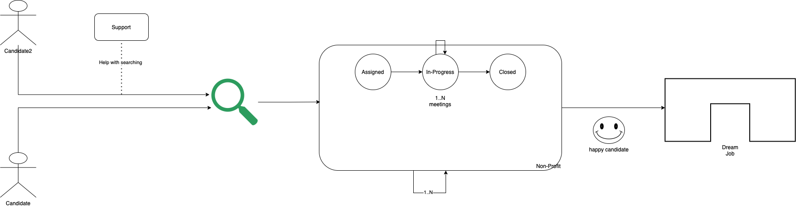

# Process view 

The process view deals with the dynamic aspects of the system, explains the system processes and how they communicate, and focuses on the run time behavior of the system. The process view addresses concurrency, distribution, integrator, performance, and scalability, etc. UML diagrams to represent process view include the sequence diagram, communication diagram, activity diagram.

## Networking Hub Functionality & Process

#### Operational Process - Registration & Intake (Non-Profit)
* Step 1 New Non-Profit registers on platform
* Step 2 New Non-Profit completes community profile
* Step 3 New Non-Profit completes service capabilities assessment
* Step 4 Completion of profile and assessment automatically starts intake
* Step 5 New Non-Profit assignment created
 
#### Operational Process - Mentor Assignment & Roadmap
* Step 6 New Non-Profit assigned a community leader
* Step 7 Email sent to new Non-Profit introducing community leader
* Step 8 Introductory meeting is schedule within 1-2 weeks to discuss non profit service capabilities, responsibilities, & expectations
* Step 9 Regular cadence touchpoints scheduled between new non-profit and community leader
* Step 10 Platform Role based training is assigned to new Non-Profit Step 11 New Non-Profit is invited to monthly community meetings Career Case Management Functionality & Process

#### Operational Process - Registration & Intake (Non-Profit)
* Step 1 New Non-Profit registers on platform
* Step 2 New Non-Profit completes community profile
* Step 3 New Non-Profit completes service capabilities assessment Step 4 Completion of profile and assesment automatically starts intake
* Step 5 New Non-Profit assignment created

#### Operational Process - Mentor Assignment & Roadmap
* Step 6 New Non-Profit assigned a community leader
* Step 7 Email sent to new Non-Profit introducing community leader
* Step 8 Introductory meeting is schedule within 1-2 weeks to discuss non profit service capabilities, responsibilities, & expectations
* Step 9 Regular cadence touchpoints scheduled between new non-profit and community leader
* Step 10 Platform Role based training is assigned to new Non-Profit Step 11 New Non-Profit is invited to monthly community meetings

