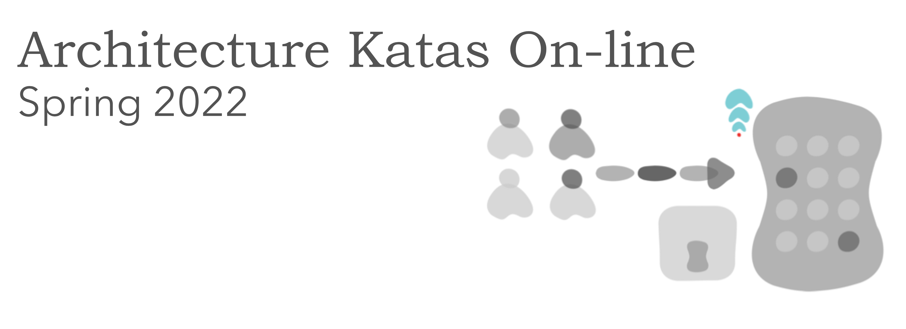

# O'Reilly Architecture Katas 2022

### Spotlight App/Platform [taken from O'Reilly Architecture Katas 2022 assignment]
* **Program Summary:** The Spotlight App Project is a sustained effort to amass a coalition of nonprofits in order to address specific needs within the communities we serve by leveraging a centralized platform as the base of operations to collaborate and make a collective impact.
    * **Problem Statement #1:** The decentralization and lack of support between nonprofits create gaps of service and overall impact.
    * **Problem Statement #2:** The lack of visibility of nonprofit groups and offerings creates a barrier of access to the people we aim to serve.

Technology Solution Description: Nonprofit Networking Hub & Diverse Candidate Career Case Management Tool

Almost all text in this section is taken from assignment of O'Reilly Architecture Katas 2022

## The vision 

We want to achieve
   * TODO

## Review of requirements on the project [taken from O'Reilly Architecture Katas 2022 assignment]

The Platform must establish a way to incentivize engagement such as sharing of resources, collaboration, networking, facilitating introductions, and partnerships
The Platform must categorize/tag nonprofit support services to match candidate needs identified in the onboarding assessment to include but not limited to
 * Resume Writing Services
 * Interview Prep
 * Free Business Attire
 * Apprenticeship Program Registration
 * Training Program Registration
 * College & University Registration
 * Free Grocery & Meal Services
 * Discounted Rent & Housing Services
 * Daycare/Child Care Services
 * Mentorship/Career Advocate Services
---
 * End-Use Ease of Use is a hard requirement
 * Tracking candidate progress is a hard requirement
 * Tracking engagement is a hard requirement
 * The Platform must provide a way to allow Non-Profits to publicize offerings to the platform that can provide some level of automatic matching for Candidate requests.
 * The Platform allows offerings to contain rich text, links, and downloadable readable content such as PDFs, but no other downloads.
 * Each offering must support a certain list of properties (defined by the platform), such as name, organization description, website, unique identifier (assigned by the Administrators) and other identification information.
 * The Platform must provide both operational reports (number of candidate matches / period, number of offerings / region, and so on) and analytical reports (projections of future desirable career paths, Offering gaps in a region based on demand, and so on) for use by Administrators.

## State of the art

TODO 
 * Buzzword section with words like #cloud/#microservices/#scaling/#ubermodernprogramminglanguage/#reactui and so on
 * We need to target our strategy with this project - create minimal viable product or are we building whole new corporate business?
 * definition of buget here - non-profit organization

## Methodology description

**What we trying to describe with these architecture documents?**

TODO
 * “Why is more important then how”
 * big picture
 * helicopter view
 * detail by role - business view / technical view
 * 

**How do we structurized architecture documents?**

TODO
  * https://en.wikipedia.org/wiki/4+1_architectural_view_model
  * how to read documents - this page is index, others are in detail
  * 
  * 

**Why we omits some details** 
TODO
  * level of details are variable per topic
  * reason is our time we spent on it
  * it is not necessary to describe everything - we need to identify and capture ideas and decisionos that will be not easy to change in the future. Documentation of live system artefacts like code is better to generate directly from code - fe swagger API .  

## Architecture decision records 

TODO / show list (maybe table?) of our ADRs 

## Views on the project

TODO / link every views on project with short description what it is about

### [Scenarios / Key capabilities](Scenarios/README.md)
The description of an architecture is illustrated using a small set of use cases, or scenarios, which become a fifth view. The scenarios describe sequences of interactions between objects and between processes. They are used to identify architectural elements and to illustrate and validate the architecture design. They also serve as a starting point for tests of an architecture prototype. This view is also known as the use case view.

### [Logical view](LogicalView/README.md)
The logical view is concerned with the functionality that the system provides to end-users. UML diagrams are used to represent the logical view, and include class diagrams, and state diagrams.

### [Process view](ProcessView/README.md)
The process view deals with the dynamic aspects of the system, explains the system processes and how they communicate, and focuses on the run time behavior of the system. The process view addresses concurrency, distribution, integrator, performance, and scalability, etc. UML diagrams to represent process view include the sequence diagram, communication diagram, activity diagram.

### [Development view](DevelopmentView/README.md)
The development view illustrates a system from a programmer's perspective and is concerned with software management. This view is also known as the implementation view. UML Diagrams used to represent the development view include the Package diagram and the Component diagram.

### [Physical view](PhysicalView/README.md)
The physical view (aka the deployment view) depicts the system from a system engineer's point of view. It is concerned with the topology of software components on the physical layer as well as the physical connections between these components. UML diagrams used to represent the physical view include the deployment diagram.

TODO 
**We need to have answers for this questions here**

* Are the architecture characteristics demonstrated in the solution?
* Is the solution appropriate and feasible given the project constraints?
* Are the architecture styles selected represented in the solution?

Say where we trying to solve this properties: Integration, Feasibility, Agility, Availability,Security, Scalability